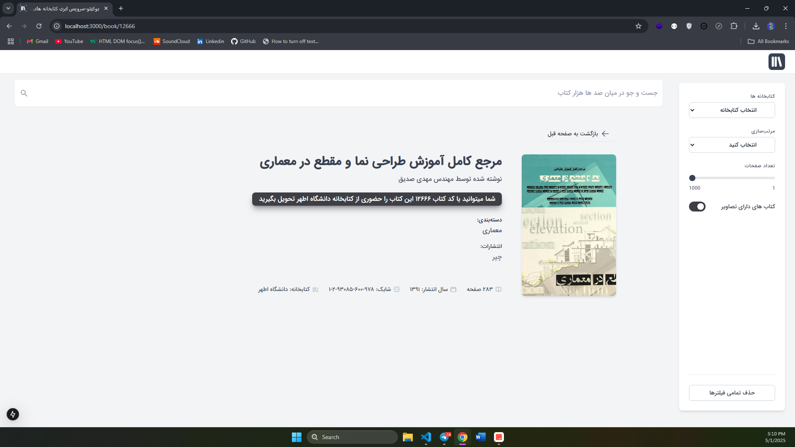

# Boookito Frontend Version 4.0.0

Since 2021, I've been continuously working on this project with no personal financial gain. I've always kept the services up to date, maintained, and improved them over time. I've never cut corners when it came to this platform.

In the latest release—version 3—I faced numerous issues, including inconsistent design, deprecated packages, and outdated versions of React, Next.js, and Tailwind CSS. So, I decided to take a new approach: a simpler, cleaner, and more minimal UI, avoiding unnecessary features.


As a result, on May 1st, 2025, I'm launching version 4 as a test release.


## Improvement
The addition of advanced search and filtering, as well as reducing unnecessary requests, have all been part of the redesign and improvement in version 4.0.0 .


## <h4> HomePage </h4> 


## <h4> BookPage </h4> 


## Technologies Used

- [Next.js 15](https://nextjs.org/docs/getting-started)
- [HeroUI v2](https://heroui.com/)
- [Tailwind CSS](https://tailwindcss.com/)
- [Tailwind Variants](https://tailwind-variants.org)
- [TypeScript](https://www.typescriptlang.org/)
- [Framer Motion](https://www.framer.com/motion/)
- [next-themes](https://github.com/pacocoursey/next-themes)


### Install dependencies

You can use one of them `npm`, `yarn`, `pnpm`, `bun`, Example using `npm`:

```bash
npm install
```

### Run the development server

```bash
npm run dev
```

### Setup pnpm (optional)

If you are using `pnpm`, you need to add the following code to your `.npmrc` file:

```bash
public-hoist-pattern[]=*@heroui/*
```

After modifying the `.npmrc` file, you need to run `pnpm install` again to ensure that the dependencies are installed correctly.


